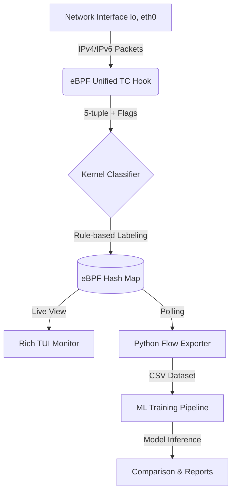

# NET4000_TEAM7 - Network Traffic Classification with eBPF


Capture, analyze, and classify network traffic directly in the Linux kernel using eBPF (Extended Berkeley Packet Filter). This pipeline features unified protocol support, advanced feature extraction, and real-time observability for machine learning applications.

## Key Features

- **Unified IPv4/IPv6 Support**: Single eBPF program handles both address families natively using a unified flow key.
- **TCP Flags Extraction**: Captures and aggregates TCP flags (SYN, ACK, FIN, RST, etc.) to improve ML classification accuracy and security detection.
- **Real-time TUI Monitor**: A high-performance terminal dashboard for live flow tracking and observability.
- **Automated Pipeline**: Integrated Makefile for building, testing, training, and benchmarking.
- **Performance Comparison**: Automated comparison between in-kernel rule-based and user-space ML-based classification.

## Architecture



## Prerequisites

- Linux Kernel 5.4+ (with BPF support)
- `clang`, `llvm`, `libbpf-dev`
- `bpftool`, `iproute2` (`tc`)
- `python3`, `pip`, `venv`

## Quick Start

```bash
# 1. Setup Environment
make install-deps

# 2. Build eBPF Programs
make build

# 3. Monitor Traffic Live (In a separate terminal)
sudo ./ml_env/bin/python src/flow_monitor.py

# 4. Run Full capture and analysis pipeline
echo admin | sudo -S make all
```

## Makefile Commands

- `make build`: Compile eBPF C programs.
- `make test`: Run traffic capture and export to CSV.
- `make train`: Train ML models on captured data.
- `make compare`: Compare kernel vs user-space classifier performance.
- `make all`: Run build, test, train, and compare in sequence.
- `make bench`: Run RTT performance benchmark.

## Project Structure

- [`src/`](./src) - Core eBPF C programs and Python exporters.
  - `tc_flow_full.bpf.c`: Unified IPv4/IPv6 flow tracker with flag extraction.
  - `flow_monitor.py`: Real-time TUI dashboard.
- [`ml/`](./ml) - Machine Learning training and analysis scripts.
- [`scripts/bench/`](./scripts/bench) - Performance and latency benchmarks.
- [`scripts/traffic/`](./scripts/traffic) - Traffic generation utilities.

## Verification

To verify the entire pipeline in one go:
```bash
echo admin | sudo -S make clean && make build && echo admin | sudo -S make all && echo admin | sudo -S make bench
```
