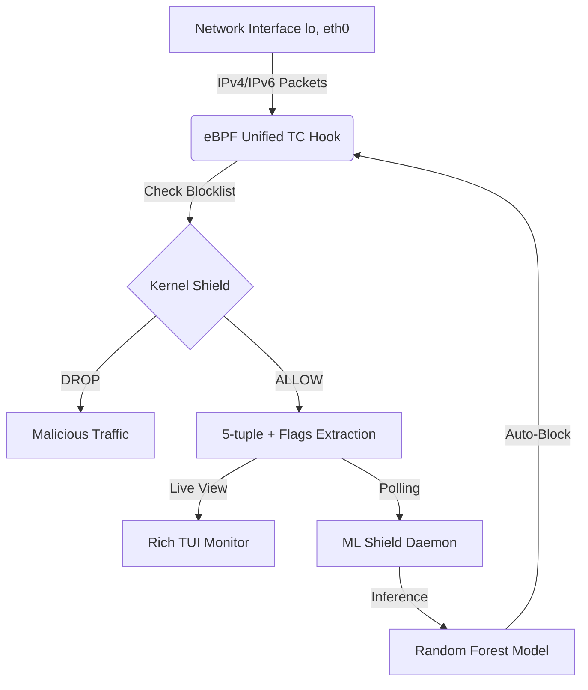

# NET4000_TEAM7 - Network Traffic Classification with eBPF


Capture, analyze, and classify network traffic directly in the Linux kernel using eBPF (Extended Berkeley Packet Filter). This pipeline features unified protocol support, advanced feature extraction, and real-time observability for machine learning applications.

## Key Features

- **Adaptive ML Shield**: Real-time, zero-latency mitigation engine that drops malicious traffic at the kernel level using eBPF `block_list` maps.
- **Intelligent ML Enforcement**: A background daemon that performs live inference on network flows and automatically blacklists IPs flagged by the Random Forest model.
- **Dynamic Kernel Tuning**: Adjust packet thresholds and toggle mitigation modes on-the-fly via eBPF `config` maps without recompiling.
- **Unified IPv4/IPv6 Support**: Single eBPF program handles both address families natively using a unified flow key.
- **TCP Flags Extraction**: Captures and aggregates TCP flags (SYN, ACK, FIN, RST, etc.) to improve ML classification accuracy and security detection.
- **Real-time TUI Monitor**: Enhanced dashboard for live flow tracking and manual "Smart Shield" control.

## Architecture



## Prerequisites

- Linux Kernel 5.4+ (with BPF support)
- `clang`, `llvm`, `libbpf-dev`
- `bpftool`, `iproute2` (`tc`)
- `python3`, `pip`, `venv`

## Quick Start

```bash
# 1. Setup Environment
make install-deps

# 2. Build eBPF Programs
make build

# 3. Train ML Model
make train

# 4. Start the Intelligent Shield (In a separate terminal)
sudo make shield-run

# 5. Monitor Live (In a separate terminal)
sudo ./ml_env/bin/python src/flow_monitor.py
```

## Makefile Commands

- `make build`: Compile eBPF C programs.
- `make shield-test`: Run end-to-end verification of the ML Shield.
- `make shield-run`: Start the ML-driven mitigation daemon.
- `make test`: Run traffic capture and export to CSV.
- `make train`: Train ML models on captured data.
- `make compare`: Compare kernel vs user-space classifier performance and generate impact plots.
- `make bench`: Run RTT performance benchmark.
- `make all`: Run build, test, train, and compare in sequence.
- `make verify`: Run a clean build and execute the full pipeline from scratch.

## Project Structure

- [`src/`](./src) - Core eBPF C programs and Python exporters.
  - `tc_flow_full.bpf.c`: Unified IPv4/IPv6 flow tracker with flag extraction.
  - `flow_monitor.py`: Real-time TUI dashboard.
- [`ml/`](./ml) - Machine Learning training and analysis scripts.
- [`scripts/bench/`](./scripts/bench) - Performance and latency benchmarks.
- [`scripts/traffic/`](./scripts/traffic) - Traffic generation utilities.

## Verification

To verify the entire pipeline (cleaning, building, testing, training, and benchmarking) in one command:
```bash
sudo make verify
```
